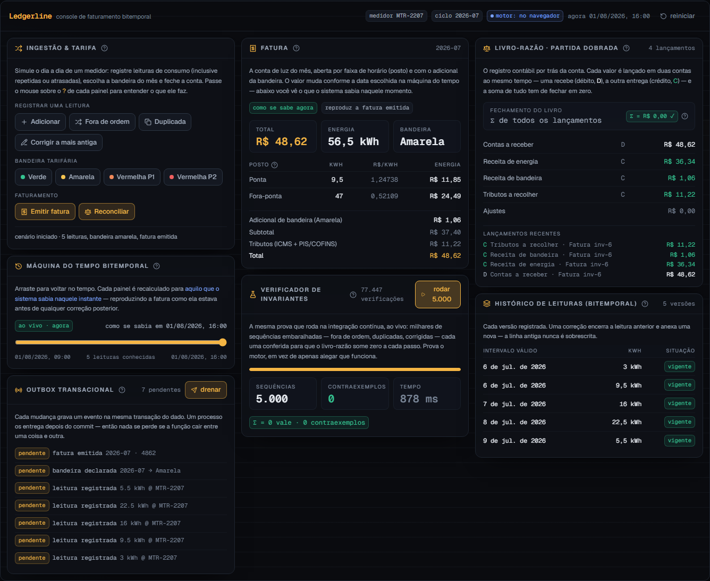
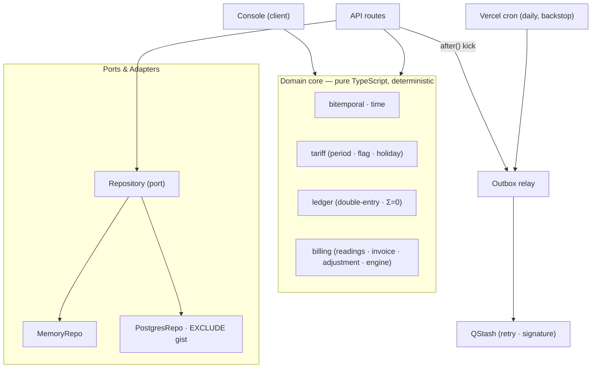

# Ledgerline

[Português](README.md) · **English**

**A bitemporal energy-billing engine — idempotent ingestion, a versioned tariff, a double-entry ledger, and a history the database itself enforces.**

Ledgerline charges for the reading a meter produces: it ingests readings idempotently and out of order, prices them against a versioned ANEEL tariff (period, flag, moving holiday), posts to a double-entry ledger that always sums to zero, and keeps a bitemporal history — `valid_time` × `transaction_time` — that reproduces any past invoice as it was known on any date. A retroactive change issues an adjustment note; the original invoice is never edited.

> _Prove it with a number, don't claim it._ The ledger's zero-sum invariant is checked by property, over thousands of scrambled sequences — in CI and, in the console, live in your browser.

<p align="center">
  
</p>

---

## What it does

- **Idempotent ingestion** — every reading carries an idempotency key. The same key, however many times it arrives and in any order, is the same fact. Re-delivery is a no-op; out-of-order is natural, because readings are keyed by their `valid_time` interval, not by arrival.
- **Real bitemporality** — two axes per fact: `valid_time` (when consumption happened) × `transaction_time` (when the system learned it). An "as-of" query reproduces the invoice exactly as it stood at any point in the past.
- **Versioned tariff — rule is data** — period (peak/intermediate/off-peak), flag (green/yellow/red), and moving holidays derived from Easter are all versioned data, not branches. A period's hour window is a row, not a code path.
- **Retroactive recomputation** — a reading correction or a re-declared flag for an already-invoiced month issues an **adjustment note** for the delta. The original invoice stays immutable and auditable.
- **Double-entry ledger** — every financial event posts balanced debit/credit legs in integer cents. The sum is always zero — per transaction and across the whole book. An unbalanced transaction is unrepresentable: the constructor refuses it.
- **Transactional outbox** — each mutation writes its event in the same transaction as the fact; a relay drains it to QStash after the commit. The serverless function can die between commit and publish, and no event is lost.

## Live demo

The console above runs the entire billing engine in the browser, deterministically. Inject out-of-order and duplicate readings, change the flag, issue the invoice, correct the earliest reading and reconcile to see the adjustment note, drag the `transaction_time` axis to reconstruct the past, and run the invariant harness — thousands of sequences, zero counterexamples.

---

## The heart: database-enforced bitemporality + double-entry

A bitemporal fact carries two independent half-open ranges:

```
valid_time        [consumption start, end)     — when it happened in the world
transaction_time  [inserted, ∞)                 — while the system believes it
```

A correction **never** does an `UPDATE`. It closes the prior assertion's `transaction_time` (stamps the upper bound) and appends a new open assertion. Nothing is overwritten, so any past belief is still reconstructable.

In Postgres, the invariant is the **schema**, not a code path. An exclusion constraint guarantees that, for one meter, no two open assertions overlap in `valid_time`:

```sql
CONSTRAINT readings_no_overlapping_assertion EXCLUDE USING gist (
  meter_id          WITH =,
  valid_range       WITH &&,
  transaction_range WITH &&
)
```

The ledger closes the loop: an invoice debits receivable and credits energy revenue, flag surcharge and tax, with integer-cent amounts summing to exactly the total. Integer addition is exact and order-independent — that is what makes convergence a theorem, not a hope.

---

## Architecture



The domain core is a pure function of its inputs — no clock, no randomness read inside. Two adapters implement the same `Repository` port: an in-memory one (backing the zero-config demo and most tests) and a Postgres one (the production path, where the database enforces bitemporality). `src/lib/config.ts` picks the adapter by the presence of `DATABASE_URL`.

### Determinism

The engine is a pure function of `(state, command, now)`. `now` and ids are injected by the caller — no `Date.now()` or `Math.random()` is read inside the core. A replay of the same command sequence yields byte-identical state. That is what makes convergence testable, the time-machine reproducible, and a client and server able to agree on a computation without a live connection.

### Time zone

Periods, holidays and cycles are the Brazilian civil calendar. Brazil has had no daylight saving since 2019, so BRT is a fixed UTC−03:00 — fixing the offset keeps the core pure and dependency-free.

---

## How it is proven, not asserted

- **Property tests (fast-check)** — generate thousands of out-of-order, duplicated and corrected sequences and prove: **convergence** (any order reaches the same balance), **idempotency** (re-delivery does not move the ledger), **Σ=0** (the sum is always zero), **as-of** (the versioned tariff reproduces the historical invoice) and **adjustment = delta** (the original is immutable).
- **The database enforces it** — an integration suite applies the real migration to Postgres and proves the `EXCLUDE gist` constraint **rejects** an overlapping bitemporal assertion. The store, not the app, upholds the rule.
- **Determinism** — replaying the same input yields identical state, which is what makes any of the above reproducible.

## Stack

| Area | Choice |
| --- | --- |
| Framework | Next.js 16 (App Router, Turbopack) · React 19 |
| Language | TypeScript 5.9 (strict, `noUncheckedIndexedAccess`, `verbatimModuleSyntax`) |
| Database | Postgres (Neon) · `btree_gist` · `EXCLUDE USING gist` over `tstzrange` |
| Queue | Transactional outbox · Upstash QStash (relay) · Vercel Cron (backstop) |
| UI | Tailwind v4 (semantic tokens) · Geist · lucide-react · zustand |
| Tests | Vitest 4 · fast-check (property) · Playwright + axe (e2e) · Postgres (integration) |
| Observability | `@vercel/otel` |
| Deploy | Vercel (region `gru1`) |

## Running it

```bash
npm install
npm run dev            # http://localhost:3000
```

The console runs with **zero configuration** — the engine is client-side and the API routes fall back to an in-memory repository. To enable the Postgres/QStash path, copy `.env.example` to `.env.local` and fill in the credentials.

### Scripts

```bash
npm run dev            # development server
npm run build          # production build
npm run test           # property and unit tests (Vitest + fast-check)
npm run coverage       # tests with coverage thresholds
npm run pgtest         # Postgres integration tests (requires DATABASE_URL)
npm run db:migrate     # apply migrations to DATABASE_URL
npm run e2e            # Playwright end-to-end (drives a real browser)
npm run lint           # ESLint
npm run typecheck      # tsc --noEmit
```

## Project structure

```
src/
  lib/
    domain/            # pure core, property-tested
      time · bitemporal · money · calendar · types
      tariff/          # holidays (Easter) · periods · flags · tariff
      ledger/          # accounts · ledger (Σ=0)
      billing/         # readings (idempotent) · invoice · adjustment · engine
    ports/             # Repository (the persistence port)
    adapters/
      memory/          # MemoryRepo — demo and tests
      postgres/        # PostgresRepo · migrations/0001_init.sql (EXCLUDE gist)
    outbox/            # relay · qstash
    harness/           # invariant runner (the console's)
    config.ts          # adapter selection by environment
  app/
    api/               # health · readings · invoices/[meterId] · outbox/drain · qstash
    page.tsx           # landing + console
  components/          # ui/ · console/
  store/               # billingStore (zustand)
```

## Observability

`instrumentation.ts` registers OpenTelemetry via `@vercel/otel` — spans go straight into Vercel's OTel pipeline in production, a no-op locally. **`GET /api/health`** runs a canonical invoice through the core and checks the ledger — a green check means the billing logic works, not merely that the server answered — and pings the live repository.

## Security & accessibility

A tight Content-Security-Policy in production (no third-party origins in the browser; Neon/QStash are server-side only), HSTS, `X-Content-Type-Options`, `X-Frame-Options`, `Referrer-Policy` and `Permissions-Policy`. `/api/outbox/drain` is guarded by `CRON_SECRET`; the QStash webhook verifies the signature. The UI has a single global keyboard focus ring, honours `prefers-reduced-motion`, and the e2e run passes `axe` with no violations.

## Deploy to Vercel

1. Import the repository on Vercel (framework auto-detected: Next.js).
2. Optional — provision a free Postgres on [Neon](https://neon.tech) and run `npm run db:migrate` with `DATABASE_URL` pointed at it; paste the variable into the project.
3. Optional — create a free QStash project on [Upstash](https://upstash.com/qstash) and set `QSTASH_TOKEN` and the signing keys.
4. Set `CRON_SECRET`. The daily cron (`vercel.json`) drains the outbox as a backstop.

With none of the options set, the deployment still works: the demo is client-side and the routes fall back to the in-memory backend.

---

## Alternatives considered

- **Bitemporality in the app vs. in the database.** The store enforces the invariant with `EXCLUDE gist`; the app does not trust, it is prevented. _Rejected_ leaving the check in code only — a money invariant should be unrepresentable, not merely discouraged.
- **Data-modifying CTE vs. a PL/pgSQL function for ingestion.** Close-and-insert in one CTE fires a false conflict on the exclusion constraint (the `INSERT` does not see the `UPDATE` in the same snapshot). _Rejected_ in favour of a sequential function, which is also a single atomic query — ideal for serverless.
- **Serverless driver vs. `pg`.** The runtime uses Neon's HTTP driver (ideal for ephemeral functions); migrations and integration tests use `node-postgres` over TCP (works against any Postgres). `PostgresRepo` depends on a minimal SQL executor both satisfy.
- **Floating point vs. integer cents.** Floating-point addition is not associative; thousands of out-of-order postings would drift off zero. Money is always an integer of cents, with a single rounding point per invoice line.
- **Vercel cron as the outbox relay.** The Hobby plan caps cron at once per day. _Deferred_ as the primary path in favour of a best-effort `after()` kick post-commit plus QStash with retries; the daily cron is only the backstop.

---

## License

© 2026 Igor Bahia. All rights reserved.
