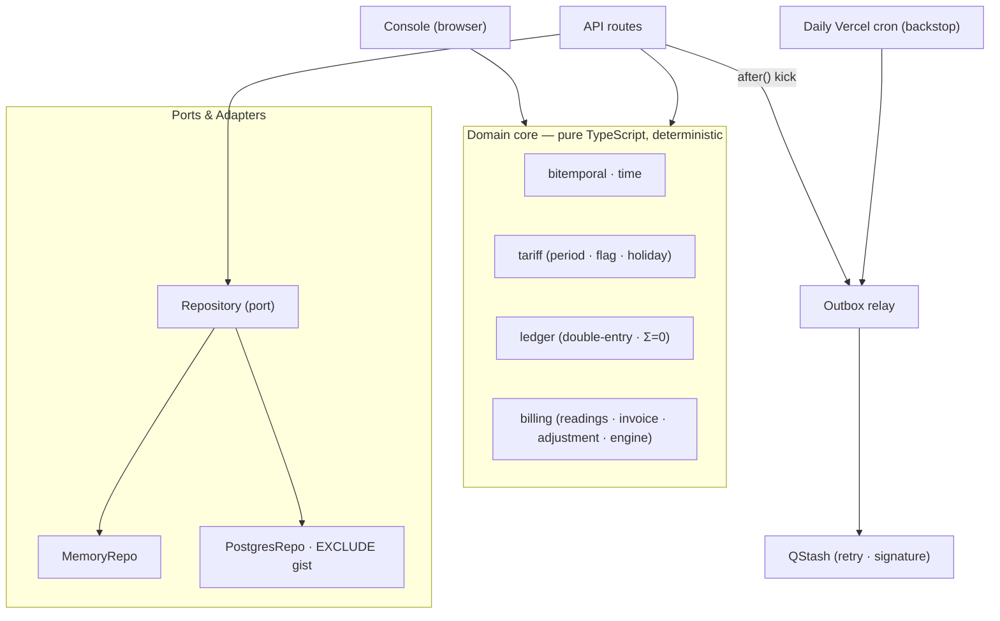

# Ledgerline

[Português](README.md) · English

**Turns the readings from an energy meter into correct electricity bills — and keeps every bill reproducible and auditable even when the data arrives duplicated, out of order, or has to be corrected after the bill was already closed.**

<p align="center">
  
</p>

> _Prove it with a number, don't claim it._

---

## Overview

Ledgerline takes the consumption readings from an energy meter and turns them into an electricity bill. The hard part is not the bill itself but everything around it: readings arrive duplicated, out of order, or wrong; the tariff changes month to month; and sometimes a value has to be corrected after the bill was already closed. A billing system has to handle all of that without ever double-charging, losing a reading, or silently rewriting a bill someone has already paid.

So the core is built around verifiable guarantees. The ledger always sums to zero; ingesting the same reading in any order reaches the same result; any past bill can be reproduced exactly as it was known on any date; and a retroactive change issues an adjustment note instead of editing the original document. Each of these guarantees is proven by an automated test.

This document opens with the guarantees, before any feature list, for one reason: in a system that handles money, what it prevents from happening matters more than what it lets you do.

## Guarantees

Each strong invariant is shown next to the command that proves it and the test that exercises it.

| Guarantee | How it is proven |
| --- | --- |
| The ledger always sums to zero — no value appears or disappears, under any sequence of operations | `npm run test` · property `the ledger balances to zero under any command sequence` |
| Ingesting the same reading out of order or duplicated converges to the same balance | `npm run test` · property `idempotent, out-of-order ingestion converges` |
| Any invoice is reproducible as it was known on any past date | `npm run test` · property `bitemporal as-of reproduces past invoices` |
| A retroactive change issues an adjustment note; the original invoice is never edited | `npm run test` · property `retroactive reconciliation issues an adjustment, never an edit` |
| Each reading is billed in exactly one cycle | `npm run test` · property `a reading is billed in exactly one cycle` |
| The database physically refuses two conflicting versions of a reading | `npm run pgtest` · test `rejects two overlapping OPEN assertions via the EXCLUDE constraint` |

The properties are generated with [fast-check](https://github.com/dubzzz/fast-check): thousands of scrambled sequences of ingestion, issuance, flag changes and reconciliation, checking the invariant after every step. The same harness runs live in the browser console over 5,000 sequences.

## Running it

```bash
npm install
npm run dev        # http://localhost:3000
```

The console runs with **zero configuration**: the entire billing engine executes in the browser, and the API routes fall back to an in-memory repository. To enable the Postgres/QStash path, copy `.env.example` to `.env.local` and fill in the credentials.

| Script | What it does |
| --- | --- |
| `npm run test` | Unit and property tests (Vitest + fast-check) |
| `npm run coverage` | Tests with coverage thresholds (lines/functions 90%, branches 85%) |
| `npm run pgtest` | Integration tests against a real Postgres (requires `DATABASE_URL`) |
| `npm run e2e` | End-to-end tests with Playwright, including accessibility (axe) |
| `npm run db:migrate` | Applies the migrations to `DATABASE_URL` |
| `npm run build` · `npm run lint` · `npm run typecheck` | Production build · ESLint · type check |

## Architecture

The domain core is a pure function of its inputs — no clock, no randomness read inside — and runs in two identical places: the browser (the console) and the server (the API routes). Two adapters implement the same persistence port: an in-memory one, backing the demo and most tests, and a Postgres one, where bitemporality is enforced by the database itself. `src/lib/config.ts` picks the adapter by the presence of `DATABASE_URL`.



**Database-enforced bitemporality.** Every fact carries two time axes: `valid_time` (when consumption happened) and `transaction_time` (when the system learned it). A correction never does an `UPDATE`: it closes the prior version's `transaction_time` and appends a new one. In Postgres, the invariant is the schema, not a code path — an exclusion constraint over `tstzrange` makes two conflicting open versions impossible:

```sql
CONSTRAINT readings_no_overlapping_assertion EXCLUDE USING gist (
  meter_id          WITH =,
  valid_range       WITH &&,
  transaction_range WITH &&
)
```

**Determinism.** The engine is `(state, command, now) → state`, with `now` and ids injected by the caller. Replaying the same command sequence yields byte-identical state — which is what makes convergence testable and "as-of" reproduction possible.

**Time zone.** Periods, holidays and cycles use the Brazilian civil calendar. Brazil has had no daylight saving since 2019, so BRT is a fixed UTC−03:00, which keeps the core pure and dependency-free.

### Stack

| Area | Choice |
| --- | --- |
| Framework | Next.js 16 (App Router, Turbopack) · React 19 |
| Language | TypeScript 5.9 (`strict`, `noUncheckedIndexedAccess`, `verbatimModuleSyntax`) |
| Database | Postgres (Neon) · `btree_gist` · `EXCLUDE USING gist` over `tstzrange` |
| Queue | Transactional outbox · Upstash QStash · Vercel Cron (backstop) |
| Interface | Tailwind v4 · Geist · zustand · light/dark theme |
| Tests | Vitest 4 · fast-check · Playwright + axe · Postgres (integration) |
| Deploy | Vercel · Node ≥ 20.11 |

## Alternatives considered

- **Bitemporality in the app vs. in the database.** The store enforces the invariant with `EXCLUDE gist`; the app does not trust, it is prevented. Leaving the check in code only was rejected — a money invariant should be unrepresentable, not merely discouraged.
- **Data-modifying CTE vs. a PL/pgSQL function for ingestion.** Close-and-insert in a single CTE fires a false conflict on the exclusion constraint, because the `INSERT` does not see the `UPDATE` in the same snapshot. Rejected in favour of a sequential function, which is also a single atomic statement — suited to a serverless environment.
- **Serverless driver vs. `pg`.** The runtime uses Neon's HTTP driver, suited to ephemeral functions; migrations and integration tests use `node-postgres` over TCP, which works against any Postgres. `PostgresRepo` depends on a minimal SQL executor both satisfy.
- **Floating point vs. integer cents.** Floating-point addition is not associative; thousands of out-of-order postings would drift off zero. Money is always an integer of cents, with a single rounding point per invoice line.
- **Vercel cron as the outbox relay.** The Hobby plan caps cron at once per day. Rejected as the primary path in favour of a best-effort kick right after commit (via `after()`) plus QStash with retries; the daily cron is only the backstop.

## Benchmarks

Measured on an Intel Core i7-6700 @ 3.40 GHz, Node 24, single-thread, with `npm run bench` (Vitest). Each figure is the pure core, with no I/O.

| Operation | Throughput | Per operation |
| --- | --- | --- |
| Issue invoice — 720 readings (a month of hourly load) | ~35,500/s | ~28 µs |
| As-of invoice query — 720 readings | ~36,500/s | ~27 µs |
| Issue invoice — 24 readings (a day) | ~118,000/s | ~8.5 µs |
| Ingest a reading — meter with 24 readings | ~195,000/s | ~5 µs |
| Ingest a reading — meter with 720 readings | ~3,650/s | ~270 µs |

The core is immutable: each operation recopies the state rather than mutating it. Ingestion cost therefore grows with the history already accumulated on the meter — hence the gap between the last two rows.

## Tests

- **Unit and property** (`npm run test`) — Vitest 4 and fast-check. The properties from the guarantees table, plus tariff computation (period, flag, Easter-derived moving holidays) and integer money arithmetic.
- **Coverage** (`npm run coverage`) — minimum thresholds of 90% lines and functions and 85% branches over the pure core, defined in `vitest.config.ts`.
- **Postgres integration** (`npm run pgtest`) — applies the real migration to a Postgres and proves the `EXCLUDE gist` constraint rejects a bitemporal overlap, plus idempotency, correction and the as-of query in the adapter. Requires `DATABASE_URL`; CI provides a Postgres with `btree_gist`.
- **End-to-end and accessibility** (`npm run e2e`) — Playwright drives the console in a real browser; the axe scan passes with no violations in light and dark themes, at widths from 390 to 1600 px.

`GET /api/health` runs a canonical invoice through the core and checks the ledger — a green result means the billing logic works, not just that the server answered.

## Security and accessibility

A tight Content-Security-Policy in production (no third-party origins in the browser; Neon and QStash server-side only), HSTS and protection headers. The outbox drain route is fail-closed and guarded by `CRON_SECRET`, compared in constant time; the QStash webhook verifies the signature. The interface has consistent keyboard focus, honours `prefers-reduced-motion`, and passes axe with no violations in both themes.

## Limitations

- The public demo runs in memory and is ephemeral — durability and real concurrency require the Postgres path, which exists and is covered by integration tests.
- The time zone is fixed BRT (UTC−03:00); it does not handle daylight saving.
- Each reading is classified by the period of its start instant, which assumes intervals that do not cross the boundary between two periods.
- Ingestion recopies the immutable state on every operation, so its cost grows with the meter's history (see Benchmarks) — suited to per-cycle billing, not a very high-frequency per-meter hot path.

## License

© 2026 Igor Bahia. All rights reserved.
