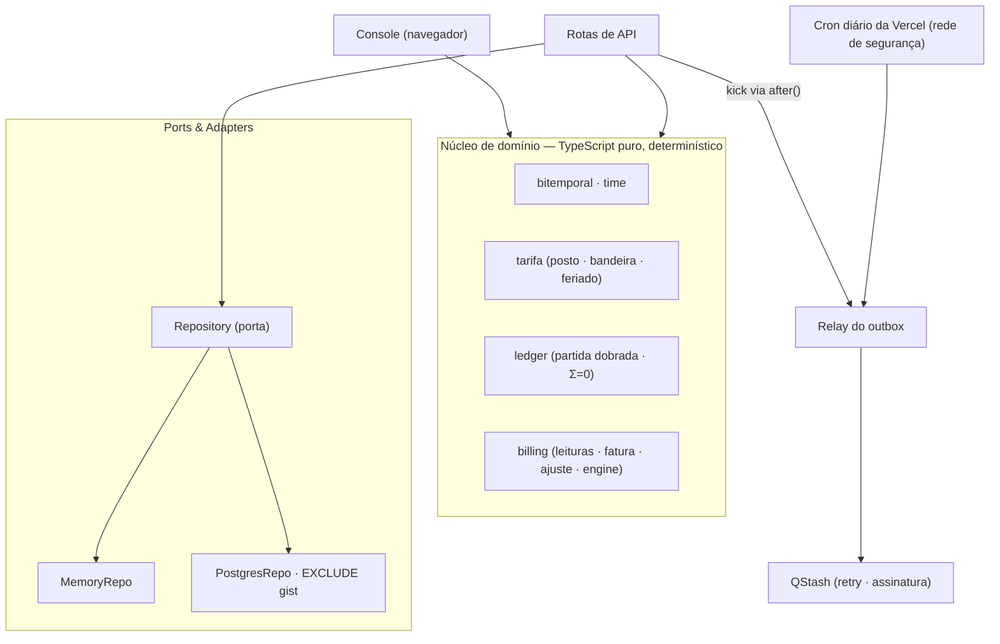

# Ledgerline

Português · [English](README.en.md)

**Transforma as leituras de um medidor de energia em contas de luz corretas — e mantém cada conta reproduzível e auditável mesmo quando os dados chegam repetidos, fora de ordem ou precisam ser corrigidos depois que a conta já foi fechada.**

<p align="center">
  
</p>

> _Provar com um número, não afirmar._

---

## Visão geral

Ledgerline recebe as leituras de consumo de um medidor de energia e as transforma numa conta de luz. A parte difícil não é a conta em si, e sim o que acontece ao redor dela: as leituras chegam repetidas, fora de ordem ou erradas; a tarifa muda de mês para mês; e às vezes um valor precisa ser corrigido depois que a conta já foi fechada. Um sistema de cobrança tem de lidar com tudo isso sem nunca cobrar em dobro, perder um consumo ou reescrever em silêncio uma conta que alguém já pagou.

Por isso o núcleo é construído em torno de garantias verificáveis. O livro-razão soma sempre zero; ingerir a mesma leitura em qualquer ordem leva ao mesmo resultado; qualquer fatura antiga pode ser reproduzida exatamente como era conhecida em qualquer data passada; e uma correção retroativa gera uma nota de ajuste, em vez de alterar o documento original. Cada uma dessas garantias é provada por um teste automatizado.

Este documento abre pelas garantias, antes de qualquer lista de funcionalidades, por um motivo: num sistema que mexe com dinheiro, o que ele impede de acontecer importa mais do que o que ele permite fazer.

## Garantias

Cada invariante forte tem, ao lado, o comando que a prova e o nome do teste que a exerce.

| Garantia | Como é provada |
| --- | --- |
| O livro-razão soma sempre zero — nenhum valor aparece ou desaparece, sob qualquer sequência de operações | `npm run test` · propriedade `the ledger balances to zero under any command sequence` |
| Ingerir a mesma leitura fora de ordem ou repetida converge ao mesmo saldo | `npm run test` · propriedade `idempotent, out-of-order ingestion converges` |
| Qualquer fatura é reproduzível como era conhecida em qualquer data passada | `npm run test` · propriedade `bitemporal as-of reproduces past invoices` |
| Uma correção retroativa emite nota de ajuste; a fatura original nunca é alterada | `npm run test` · propriedade `retroactive reconciliation issues an adjustment, never an edit` |
| Cada leitura é faturada em exatamente um ciclo | `npm run test` · propriedade `a reading is billed in exactly one cycle` |
| O banco recusa fisicamente duas versões conflitantes de uma leitura | `npm run pgtest` · teste `rejects two overlapping OPEN assertions via the EXCLUDE constraint` |

As propriedades são geradas com [fast-check](https://github.com/dubzzz/fast-check): milhares de sequências embaralhadas de ingestão, emissão, mudança de bandeira e reconciliação, verificando a invariante após cada passo. O mesmo verificador roda ao vivo no console do navegador, sobre 5.000 sequências.

## Como rodar

```bash
npm install
npm run dev        # http://localhost:3000
```

O console roda com **zero configuração**: o motor de faturamento inteiro executa no navegador, e as rotas de API recorrem a um repositório em memória. Para ativar o caminho Postgres/QStash, copie `.env.example` para `.env.local` e preencha as credenciais.

| Script | O que faz |
| --- | --- |
| `npm run test` | Testes de unidade e propriedade (Vitest + fast-check) |
| `npm run coverage` | Testes com limites de cobertura (linhas/funções 90%, ramos 85%) |
| `npm run pgtest` | Testes de integração contra um Postgres real (requer `DATABASE_URL`) |
| `npm run e2e` | Testes end-to-end com Playwright, incluindo acessibilidade (axe) |
| `npm run db:migrate` | Aplica as migrações a `DATABASE_URL` |
| `npm run build` · `npm run lint` · `npm run typecheck` | Build de produção · ESLint · verificação de tipos |

## Arquitetura

O núcleo de domínio é uma função pura das suas entradas — sem relógio nem aleatoriedade lidos por dentro — e roda em dois lugares idênticos: no navegador (o console) e no servidor (as rotas de API). Dois adaptadores implementam a mesma porta de persistência: um em memória, que alimenta a demonstração e a maior parte dos testes, e um Postgres, onde a bitemporalidade é imposta pelo próprio banco. `src/lib/config.ts` escolhe o adaptador pela presença de `DATABASE_URL`.



**Bitemporalidade imposta pelo banco.** Cada fato carrega dois eixos de tempo: `valid_time` (quando o consumo aconteceu) e `transaction_time` (quando o sistema soube). Uma correção nunca faz `UPDATE`: fecha o `transaction_time` da versão anterior e anexa uma nova. No Postgres, a invariante é o esquema, não um caminho de código — uma restrição de exclusão sobre `tstzrange` torna impossível haver duas versões abertas conflitantes:

```sql
CONSTRAINT readings_no_overlapping_assertion EXCLUDE USING gist (
  meter_id          WITH =,
  valid_range       WITH &&,
  transaction_range WITH &&
)
```

**Determinismo.** O motor é `(estado, comando, now) → estado`, com `now` e ids injetados pelo chamador. Repetir a mesma sequência de comandos produz estado byte a byte idêntico — é o que torna a convergência testável e a reprodução "as-of" possível.

**Fuso.** Postos, feriados e ciclos usam o calendário civil brasileiro. O Brasil não tem horário de verão desde 2019, então BRT é um UTC−03:00 fixo, o que mantém o núcleo puro e sem dependências.

### Stack

| Área | Escolha |
| --- | --- |
| Framework | Next.js 16 (App Router, Turbopack) · React 19 |
| Linguagem | TypeScript 5.9 (`strict`, `noUncheckedIndexedAccess`, `verbatimModuleSyntax`) |
| Banco | Postgres (Neon) · `btree_gist` · `EXCLUDE USING gist` sobre `tstzrange` |
| Fila | Outbox transacional · Upstash QStash · Cron da Vercel (rede de segurança) |
| Interface | Tailwind v4 · Geist · zustand · tema claro/escuro |
| Testes | Vitest 4 · fast-check · Playwright + axe · Postgres (integração) |
| Deploy | Vercel · Node ≥ 20.11 |

## Alternativas consideradas

- **Bitemporalidade na aplicação vs. no banco.** A store impõe a invariante com `EXCLUDE gist`; a aplicação não confia, é impedida. Deixar a checagem só no código foi rejeitado — uma invariante de dinheiro deve ser irrepresentável, não apenas desencorajada.
- **CTE que modifica dados vs. função PL/pgSQL para a ingestão.** Fechar-e-inserir num único CTE dispara um falso conflito na restrição de exclusão, porque o `INSERT` não enxerga o `UPDATE` no mesmo snapshot. Rejeitado em favor de uma função sequencial, que também é uma única instrução atômica — adequada a um ambiente serverless.
- **Driver serverless vs. `pg`.** O runtime usa o driver HTTP da Neon, adequado a funções efêmeras; migrações e testes de integração usam `node-postgres` sobre TCP, que funciona contra qualquer Postgres. O `PostgresRepo` depende de um executor SQL mínimo que ambos satisfazem.
- **Ponto flutuante vs. centavos inteiros.** A adição de ponto flutuante não é associativa; milhares de lançamentos fora de ordem sairiam do zero. O dinheiro é sempre um inteiro de centavos, com um único ponto de arredondamento por linha de fatura.
- **Cron da Vercel como relay do outbox.** O plano Hobby limita o cron a uma vez por dia. Rejeitado como caminho principal em favor de um disparo best-effort logo após o commit (via `after()`) somado ao QStash com retry; o cron diário é apenas a rede de segurança.

## Benchmarks

Medido em Intel Core i7-6700 @ 3,40 GHz, Node 24, single-thread, com `npm run bench` (Vitest). Cada número é do núcleo puro, sem I/O.

| Operação | Vazão | Por operação |
| --- | --- | --- |
| Emitir fatura — 720 leituras (mês de curva horária) | ~35.500/s | ~28 µs |
| Consulta as-of — 720 leituras | ~36.500/s | ~27 µs |
| Emitir fatura — 24 leituras (um dia) | ~118.000/s | ~8,5 µs |
| Ingerir uma leitura — medidor com 24 leituras | ~195.000/s | ~5 µs |
| Ingerir uma leitura — medidor com 720 leituras | ~3.650/s | ~270 µs |

O núcleo é imutável: cada operação recopia o estado em vez de mutá-lo. O custo da ingestão cresce, portanto, com o histórico já acumulado no medidor — daí a diferença entre as duas últimas linhas.

## Testes

- **Unidade e propriedade** (`npm run test`) — Vitest 4 e fast-check. As propriedades da tabela de garantias, mais o cálculo de tarifa (posto, bandeira, feriados móveis derivados da Páscoa) e a aritmética inteira do dinheiro.
- **Cobertura** (`npm run coverage`) — limites mínimos de 90% de linhas e funções e 85% de ramos sobre o núcleo puro, definidos em `vitest.config.ts`.
- **Integração Postgres** (`npm run pgtest`) — aplica a migração real a um Postgres e prova que a restrição `EXCLUDE gist` rejeita uma sobreposição bitemporal, além da idempotência, da correção e da consulta as-of no adaptador. Requer `DATABASE_URL`; o CI provê um Postgres com `btree_gist`.
- **End-to-end e acessibilidade** (`npm run e2e`) — Playwright dirige o console num navegador real; a varredura axe passa sem violações em tema claro e escuro, em larguras de 390 a 1600 px.

`GET /api/health` executa uma fatura canônica pelo núcleo e verifica o livro-razão — um retorno verde significa que a lógica de faturamento funciona, não apenas que o servidor respondeu.

## Segurança e acessibilidade

Content-Security-Policy restrita em produção (sem origens de terceiros no navegador; Neon e QStash só do lado do servidor), HSTS e cabeçalhos de proteção. A rota de drenagem do outbox é fail-closed e protegida por `CRON_SECRET`, comparado em tempo constante; o webhook do QStash verifica a assinatura. A interface tem foco de teclado consistente, respeita `prefers-reduced-motion` e passa axe sem violações nos dois temas.

## Limitações

- A demonstração pública roda em memória e é efêmera — durabilidade e concorrência real exigem o caminho Postgres, que existe e é coberto por testes de integração.
- O fuso é BRT fixo (UTC−03:00); não trata horário de verão.
- Cada leitura é classificada pelo posto do seu instante inicial, o que assume intervalos que não cruzam a fronteira entre dois postos.
- A ingestão recopia o estado imutável a cada operação, então seu custo cresce com o histórico do medidor (ver Benchmarks) — adequado ao faturamento por ciclo, não a um hot path de altíssima frequência por medidor.

## Licença

© 2026 Igor Bahia. Todos os direitos reservados.
