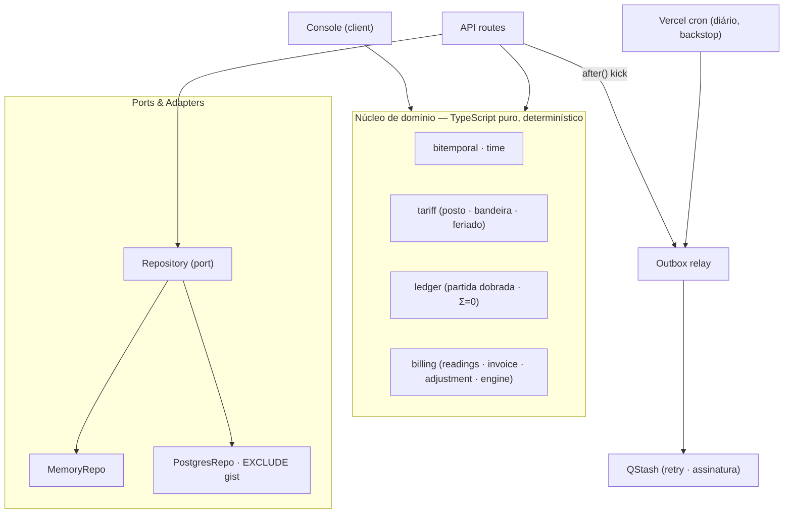

# Ledgerline

**Português** · [English](README.en.md)

**Um motor de faturamento de energia bitemporal — ingestão idempotente, tarifa versionada, ledger de partida dobrada e um histórico que o próprio banco impõe.**

O Ledgerline cobra pela leitura que um medidor produz: ingere leituras de forma idempotente e fora de ordem, precifica contra uma tarifa ANEEL versionada (posto, bandeira, feriado móvel), lança em um ledger de partida dobrada que sempre soma zero, e mantém uma história bitemporal — `valid_time` × `transaction_time` — que reproduz qualquer fatura passada como ela era conhecida em qualquer data. Uma correção retroativa emite uma nota de ajuste; a fatura original nunca é alterada.

> _Provar com um número, não afirmar._ A invariante de soma-zero do ledger é verificada por propriedade, sobre milhares de sequências embaralhadas — na CI e, no console, ao vivo no navegador.

<p align="center">
  
</p>

---

## O que faz

- **Ingestão idempotente** — cada leitura carrega uma chave de idempotência. A mesma chave, quantas vezes chegar e em qualquer ordem, é o mesmo fato. Reentrega é no-op; leitura fora de ordem é natural, porque leituras são indexadas pelo intervalo de `valid_time`, não pela chegada.
- **Bitemporalidade real** — dois eixos por fato: `valid_time` (quando o consumo aconteceu) × `transaction_time` (quando o sistema soube). A consulta "as-of" reproduz a fatura como ela estava em qualquer ponto do passado.
- **Tarifa versionada — regra é dado** — posto (ponta/intermediário/fora-ponta), bandeira (verde/amarela/vermelha) e feriados móveis derivados da Páscoa são dados versionados, não `if`. A janela horária de um posto é uma linha, não um ramo de código.
- **Recálculo retroativo** — uma correção de leitura ou um rebandeiramento de um mês já faturado emite uma **nota de ajuste** com o delta. A fatura original permanece imutável e auditável.
- **Ledger de partida dobrada** — todo evento financeiro lança débito/crédito em centavos inteiros. A soma é sempre zero — por transação e no livro inteiro. Uma transação desbalanceada é irrepresentável: o construtor a recusa.
- **Outbox transacional** — cada mutação grava seu evento na mesma transação do fato; um relay o drena para o QStash após o commit. A função serverless pode morrer entre o commit e o publish, e nenhum evento se perde.

## Demo ao vivo

O console acima roda o motor de faturamento inteiro no navegador, de forma determinística. Injete leituras fora de ordem e duplicadas, mude a bandeira, emita a fatura, corrija a leitura mais antiga e reconcilie para ver a nota de ajuste, arraste o eixo de `transaction_time` para reconstruir o passado, e rode o harness de invariantes — milhares de sequências, zero contraexemplos.

---

## O coração: bitemporalidade imposta pelo banco + partida dobrada

Um fato bitemporal carrega dois intervalos meio-abertos independentes:

```
valid_time        [consumo início, consumo fim)      — quando aconteceu no mundo
transaction_time  [inserido, ∞)                       — enquanto o sistema acredita nele
```

Uma correção **nunca** faz `UPDATE`. Ela fecha o `transaction_time` da asserção anterior (carimba o limite superior) e anexa uma nova asserção aberta. Nada é sobrescrito, então qualquer crença passada continua reconstruível.

No Postgres, a invariante é o **esquema**, não um caminho de código. Uma constraint de exclusão garante que, para um medidor, duas asserções abertas nunca se sobreponham em `valid_time`:

```sql
CONSTRAINT readings_no_overlapping_assertion EXCLUDE USING gist (
  meter_id          WITH =,
  valid_range       WITH &&,
  transaction_range WITH &&
)
```

O ledger fecha o ciclo: uma fatura debita "contas a receber" e credita receita de energia, bandeira e tributos, com os valores em centavos inteiros somando exatamente o total. Adição de inteiros é exata e independente de ordem — é isso que torna a convergência um teorema, não uma esperança.

---

## Arquitetura



O núcleo de domínio é uma função pura de suas entradas — sem relógio, sem aleatoriedade lida por dentro. Dois adaptadores implementam a mesma porta `Repository`: um em memória (que alimenta a demo sem configuração e a maioria dos testes) e um Postgres (o caminho de produção, onde o banco impõe a bitemporalidade). `src/lib/config.ts` escolhe o adaptador pela presença de `DATABASE_URL`.

### Determinismo

O motor é uma função pura de `(estado, comando, now)`. `now` e as ids são injetados pelo chamador — nenhum `Date.now()` ou `Math.random()` é lido dentro do núcleo. Um replay da mesma sequência de comandos produz estado byte a byte idêntico. É isso que torna a convergência testável, o time-machine reproduzível, e o cliente e o servidor capazes de concordar sobre um cálculo sem uma conexão ativa.

### Fuso

Postos, feriados e ciclos são calendário civil brasileiro. O Brasil não tem horário de verão desde 2019, então BRT é um UTC−03:00 fixo — fixar o offset mantém o núcleo puro e sem dependências.

---

## Como é provado, não afirmado

- **Teste de propriedade (fast-check)** — gera milhares de sequências fora de ordem, duplicadas e corrigidas, e prova: **convergência** (qualquer ordem chega ao mesmo saldo), **idempotência** (reentrega não move o ledger), **Σ=0** (soma sempre zero), **as-of** (a tarifa versionada reproduz a fatura histórica) e **ajuste = delta** (a original é imutável).
- **O banco impõe** — a suíte de integração aplica a migração real a um Postgres e prova que o `EXCLUDE gist` **rejeita** uma asserção bitemporal sobreposta. A store, não a aplicação, sustenta a regra.
- **Determinismo** — o replay da mesma entrada gera estado idêntico, o que é o que torna qualquer um dos itens acima reproduzível.

## Stack

| Área | Escolha |
| --- | --- |
| Framework | Next.js 16 (App Router, Turbopack) · React 19 |
| Linguagem | TypeScript 5.9 (strict, `noUncheckedIndexedAccess`, `verbatimModuleSyntax`) |
| Banco | Postgres (Neon) · `btree_gist` · `EXCLUDE USING gist` sobre `tstzrange` |
| Fila | Transactional outbox · Upstash QStash (relay) · Vercel Cron (backstop) |
| UI | Tailwind v4 (tokens semânticos) · Geist · lucide-react · zustand |
| Testes | Vitest 4 · fast-check (propriedade) · Playwright + axe (e2e) · Postgres (integração) |
| Observabilidade | `@vercel/otel` |
| Deploy | Vercel (região `gru1`) |

## Como rodar

```bash
npm install
npm run dev            # http://localhost:3000
```

O console roda com **zero configuração** — o motor é client-side e as rotas de API caem para um repositório em memória. Para ativar o caminho Postgres/QStash, copie `.env.example` para `.env.local` e preencha as credenciais.

### Scripts

```bash
npm run dev            # servidor de desenvolvimento
npm run build          # build de produção
npm run test           # testes de propriedade e unidade (Vitest + fast-check)
npm run coverage       # testes com thresholds de cobertura
npm run pgtest         # testes de integração Postgres (requer DATABASE_URL)
npm run db:migrate     # aplica as migrações a DATABASE_URL
npm run e2e            # Playwright end-to-end (dirige um browser real)
npm run lint           # ESLint
npm run typecheck      # tsc --noEmit
```

## Estrutura do projeto

```
src/
  lib/
    domain/            # núcleo puro, testável por propriedade
      time · bitemporal · money · calendar · types
      tariff/          # holidays (Páscoa) · periods (posto) · flags (bandeira) · tariff
      ledger/          # accounts · ledger (Σ=0)
      billing/         # readings (idempotente) · invoice · adjustment · engine
    ports/             # Repository (a porta de persistência)
    adapters/
      memory/          # MemoryRepo — demo e testes
      postgres/        # PostgresRepo · migrations/0001_init.sql (EXCLUDE gist)
    outbox/            # relay · qstash
    harness/           # runner de invariantes (o do console)
    config.ts          # seleção de adaptador por ambiente
  app/
    api/               # health · readings · invoices/[meterId] · outbox/drain · qstash
    page.tsx           # landing + console
  components/          # ui/ · console/
  store/               # billingStore (zustand)
```

## Observabilidade

`instrumentation.ts` registra o OpenTelemetry via `@vercel/otel` — spans vão direto para o pipeline OTel da Vercel em produção, no-op localmente. **`GET /api/health`** roda uma fatura canônica pelo núcleo e verifica o ledger — um check verde significa que a lógica de faturamento funciona, não só que o servidor respondeu — e pinga o repositório ativo.

## Segurança & acessibilidade

Content-Security-Policy restrita em produção (sem origens de terceiros no browser; Neon/QStash só do lado do servidor), HSTS, `X-Content-Type-Options`, `X-Frame-Options`, `Referrer-Policy` e `Permissions-Policy`. `/api/outbox/drain` é protegido por `CRON_SECRET`; o webhook do QStash verifica a assinatura. A UI tem um focus-ring de teclado único e global, respeita `prefers-reduced-motion`, e o e2e roda `axe` sem violações.

## Deploy no Vercel

1. Importe o repositório na Vercel (framework detectado: Next.js).
2. Opcional — provisione um Postgres gratuito no [Neon](https://neon.tech) e rode `npm run db:migrate` apontando `DATABASE_URL` para ele; cole a variável no projeto.
3. Opcional — crie um projeto QStash gratuito no [Upstash](https://upstash.com/qstash) e defina `QSTASH_TOKEN` e as chaves de assinatura.
4. Defina `CRON_SECRET`. O cron diário (`vercel.json`) drena o outbox como rede de segurança.

Sem nenhuma das opções, o deploy funciona: a demo é client-side e as rotas caem para o backend em memória.

---

## Alternativas consideradas

- **Bitemporalidade na aplicação vs. no banco.** A store impõe a invariante com `EXCLUDE gist`; a aplicação não confia, é impedida. _Rejeitado_ deixar a checagem só no código — uma invariante de dinheiro deve ser irrepresentável, não meramente desencorajada.
- **Data-modifying CTE vs. função PL/pgSQL para a ingestão.** Fechar-e-inserir num único CTE dispara um falso conflito na constraint de exclusão (o `INSERT` não enxerga o `UPDATE` no mesmo snapshot). _Rejeitado_ em favor de uma função sequencial, que também é uma única query atômica — ideal para serverless.
- **Driver serverless vs. `pg`.** O runtime usa o driver HTTP da Neon (ideal para funções efêmeras); migrações e testes de integração usam `node-postgres` sobre TCP (funciona contra qualquer Postgres). O `PostgresRepo` depende de um executor SQL mínimo que ambos satisfazem.
- **Ponto flutuante vs. centavos inteiros.** Adição de ponto flutuante não é associativa; milhares de lançamentos fora de ordem sairiam do zero. Dinheiro é sempre um inteiro de centavos, com um único ponto de arredondamento por linha de fatura.
- **Cron da Vercel como relay do outbox.** O plano Hobby limita cron a uma vez por dia. _Adiado_ como caminho principal em favor do kick best-effort via `after()` pós-commit + QStash com retry; o cron diário é só a rede de segurança.

---

## Licença

© 2026 Igor Bahia. Todos os direitos reservados.
